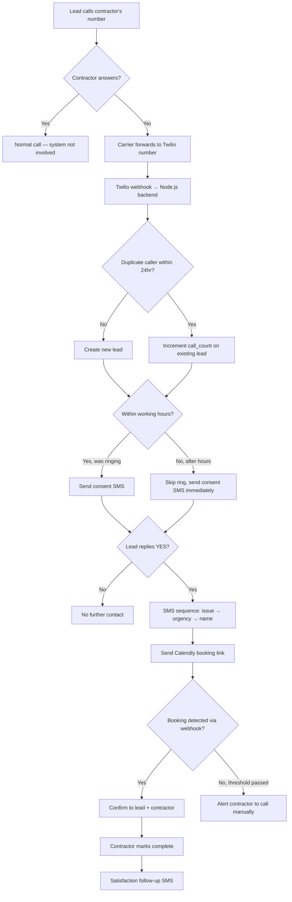

# Missed-Lead Recovery SaaS — Implementation Plan

## Summary of Decisions

| Decision | Choice |
|---|---|
| Call detection | Conditional call forwarding from contractor's existing number to Twilio (preferred), or new Twilio number (fallback) |
| SMS/Voice platform | Twilio |
| SMS conversation | Fixed sequence in V1, AI-driven in V2 |
| Consent model | Explicit opt-in (GDPR, first SMS is consent gate) |
| Calendar booking | Calendly — each contractor creates a free account, provides their scheduling link |
| DNR threshold | Configurable: urgent = 1hr, non-urgent = 24hr |
| Caller ID | Passthrough lead's real number to contractor when forwarding (verify Finnish regulations) |
| Deduplication | Same phone within 24hr = same lead, with call count noted |
| After-hours | Contractor sets working hours + emergency policy; after-hours calls skip ring, go to SMS |
| Revenue tracking | Trade-based default values, contractor can override per lead |
| Pricing | Tiered SaaS with SMS cap |
| Launch market | Finland (+358), then Portugal, then US |
| Contractor interface | Flutter Android app |
| Backend | Supabase (EU Frankfurt) + Node.js (TypeScript) |
| Onboarding | Manual for first 5, self-serve after |

---

## Architecture



### Components

**1. Node.js Backend (TypeScript)**
Hosted on a VPS or Railway/Render (EU region). Handles:
- Twilio voice webhooks (detect missed/declined calls)
- Twilio SMS webhooks (receive lead responses)
- Outbound SMS via Twilio
- Calendly webhook listener (detect bookings)
- Scheduled jobs (DNR checks, follow-ups, satisfaction surveys)
- Push notifications to the Flutter app via Firebase Cloud Messaging (FCM)
- REST API for the Flutter app (leads list, stats, settings)

**2. Supabase (Frankfurt EU region)**
- **Auth**: Contractor login (email/password for V1)
- **Database (Postgres)**: Contractors, leads, conversations, bookings, follow-ups
- **Realtime**: Push lead status changes to the Flutter app
- **Storage**: Not needed in V1

**3. Flutter Android App**
- Lead list with statuses (new → contacted → booked → completed → followed-up)
- Lead detail: conversation log, urgency, booking time, notes
- Dashboard: recovered revenue, response rate, missed calls this month
- Settings: business name, urgency thresholds, working hours
- Push notifications for new leads and DNR alerts

**4. Twilio**
- One Twilio number per contractor — receives forwarded calls from their existing number
- During onboarding, ask: "Do you want to forward your existing number to us, or do you want a new dedicated number?"
  - **Option A (preferred):** Contractor sets up conditional call forwarding (forward on no-answer) from their existing number to the Twilio number. Lead calls the number they already know. If contractor answers, system is never involved. If not, Twilio catches it.
  - **Option B (fallback):** Provision a new Twilio +358 number that becomes the contractor's public number. Simpler technically but requires the contractor to change their published number.
- Voice: webhook fires on incoming call with `CallStatus`
- Caller ID: set to lead's real phone number when forwarding to contractor, so they see who's calling. Finnish regulations on caller ID spoofing need verification before launch — if not allowed, display Twilio number with lead name in push notification instead.
- SMS: send/receive via Programmable Messaging
- A2P 10DLC registration is US-only; Finland uses standard long codes

---

## Database Schema

Core tables in Supabase Postgres:

```sql
-- Contractor account
contractors (
  id uuid PK,
  business_name text NOT NULL,
  contact_name text NOT NULL,
  contact_email text NOT NULL,
  contact_phone text NOT NULL,             -- contractor's real phone
  twilio_phone_number text NOT NULL,       -- Twilio number (forwarding target or new number)
  number_setup_type text DEFAULT 'forwarding', -- 'forwarding' | 'new_number'
  calendly_url text,                       -- their Calendly scheduling link
  trade_type text,                         -- plumber | hvac | electrician | roofer | other
  default_job_value decimal,               -- trade-based default, set during onboarding
  urgency_threshold_urgent_min int DEFAULT 60,    -- minutes before DNR alert
  urgency_threshold_normal_min int DEFAULT 1440,  -- 24 hours
  working_hours_start time DEFAULT '08:00',
  working_hours_end time DEFAULT '18:00',
  working_days int[] DEFAULT '{1,2,3,4,5}', -- 1=Mon, 7=Sun
  after_hours_emergency_policy text,       -- contractor's own words on what counts as emergency
  after_hours_ring boolean DEFAULT false,  -- whether to ring contractor on after-hours emergency
  timezone text DEFAULT 'Europe/Helsinki',
  tier text DEFAULT 'starter',             -- starter | growth | pro
  monthly_sms_cap int DEFAULT 50,
  sms_used_this_month int DEFAULT 0,
  stripe_customer_id text,
  created_at timestamptz DEFAULT now(),
  updated_at timestamptz DEFAULT now()
)

-- Each missed call becomes a lead
leads (
  id uuid PK,
  contractor_id uuid FK → contractors.id,
  caller_phone text NOT NULL,              -- lead's phone number
  caller_name text,                        -- collected via SMS
  issue_description text,                  -- collected via SMS
  urgency text DEFAULT 'unknown',          -- unknown | low | medium | high | emergency
  email text,                              -- optional, collected via SMS
  call_count int DEFAULT 1,                -- incremented on duplicate calls within 24hr
  status text DEFAULT 'missed',            -- missed → consent_sent → opted_in → qualifying → booking_sent → booked → completed → followed_up | dnr_alert | no_consent
  consent_given boolean DEFAULT false,
  consent_given_at timestamptz,
  booking_time timestamptz,                -- from Calendly
  calendly_event_id text,
  dnr_alert_sent boolean DEFAULT false,
  dnr_alert_sent_at timestamptz,
  estimated_value decimal,                 -- contractor can override; defaults to contractor.default_job_value
  satisfaction_score int,                  -- 1-5 from follow-up
  satisfaction_feedback text,
  called_during_after_hours boolean DEFAULT false,
  created_at timestamptz DEFAULT now(),
  updated_at timestamptz DEFAULT now()
)

-- Full SMS conversation log
messages (
  id uuid PK,
  lead_id uuid FK → leads.id,
  direction text NOT NULL,                 -- inbound | outbound
  body text NOT NULL,
  twilio_message_sid text,
  sent_at timestamptz DEFAULT now()
)

-- Scheduled tasks (DNR checks, follow-ups)
scheduled_tasks (
  id uuid PK,
  lead_id uuid FK → leads.id,
  task_type text NOT NULL,                 -- dnr_check | satisfaction_followup | reminder
  execute_at timestamptz NOT NULL,
  executed boolean DEFAULT false,
  created_at timestamptz DEFAULT now()
)
```

Row Level Security (RLS) policies ensure contractors only see their own data. This is mandatory for Supabase + GDPR.

---

## Workflow Detail

### Phase 1: Missed Call Detection

Call arrives at the Twilio number (either directly or via conditional forwarding from the contractor's existing number):

1. Twilio sends a voice webhook to `POST /webhooks/twilio/voice`
2. Backend checks: is this within working hours?
   - **Within hours:** Return TwiML that rings the contractor's real phone (with caller ID set to the lead's number if regulations allow). If no answer within ~20 seconds, Twilio fires status callback with `CallStatus: no-answer`.
   - **After hours:** Skip ringing. Return TwiML that plays a brief message ("We've received your call, you'll get a text shortly") and hangs up.
3. On `no-answer`, `busy`, or after-hours, the backend checks for deduplication:
   - Query `leads` for same `caller_phone` + same `contractor_id` where `created_at > now() - 24 hours`
   - If found: increment `call_count` on existing lead, add a note. Do NOT send another consent SMS.
   - If not found: create a new lead and trigger the SMS flow.
4. If the lead called multiple times (call_count > 1), the contractor sees "Called 3 times" in the app — this signals high intent.

Configuration needed per contractor:
- Their real phone number (where Twilio forwards the call)
- Ring timeout (seconds before treating as missed)
- Working hours, working days, timezone
- After-hours emergency policy (free text, displayed in app when after-hours lead comes in)
- Whether to ring on after-hours emergencies

### Phase 2: Consent + Qualification SMS Sequence

**Message 1 — Consent (fires immediately after missed call):**
> "Hi, you just tried to reach [Business Name]. We can help get you connected. Reply YES if you'd like us to arrange a callback, or STOP to opt out."

If no reply within 30 minutes, no further contact. Lead status → `no_consent`.

**Message 2 — Issue (fires on YES reply):**
> "What issue are you experiencing? (e.g., leaking pipe, broken AC, electrical problem)"

**Message 3 — Urgency (fires after issue reply):**
> "How urgent is this? Reply 1-4:
> 1 — Emergency (flooding, no power, safety risk)
> 2 — Urgent (today/tomorrow)
> 3 — This week
> 4 — Not urgent, just getting quotes"

**Message 4 — Name + Booking (fires after urgency reply):**
> "Got it. What's your name? And here's a link to book a callback at a time that works for you: [Calendly Link]"

The name is extracted from the reply. Email is not requested in V1 — it's a drop-off point and not needed for the core flow.

Each message advances the lead's status. All messages are logged to the `messages` table.

### Phase 3: Booking

- Calendly webhook fires on booking → `POST /webhooks/calendly/booking`
- Backend updates the lead: `status = 'booked'`, stores `booking_time` and `calendly_event_id`
- SMS sent to lead: "You're booked with [Business Name] on [date/time]. They'll call you at this number."
- Push notification to contractor's app: "New booking: [Name] — [Issue] — [Date/Time]"
- The booking appears on the contractor's Google Calendar automatically (Calendly handles this)

### Phase 4: DNR Detection

A scheduled job runs every 5 minutes and checks:
- Leads in `booking_sent` status where `created_at + urgency_threshold < now()` and `dnr_alert_sent = false`
- For each match:
  - SMS to contractor: "[Name] ([Phone]) hasn't booked yet. Urgency: [level]. Give them a call."
  - Push notification to app
  - `dnr_alert_sent = true`

The contractor can then manually call the lead and update the status in the app.

### Phase 5: Job Completion + Satisfaction Follow-up

- Contractor marks a lead as "completed" in the app
- This creates a `scheduled_task` with `task_type = 'satisfaction_followup'` set for 24 hours later
- When the task executes:
  > "Hi [Name], [Business Name] here. How did the service go? Reply 1-5 (1 = poor, 5 = excellent). Any feedback is appreciated."
- Response is parsed (number → `satisfaction_score`, any additional text → `satisfaction_feedback`)
- If score ≤ 2, the contractor gets an alert in the app

---

## GDPR Compliance Requirements (Finland)

These are not optional. They must be in place before any lead data is collected.

1. **Privacy Policy**: Hosted on a public URL, linked in the consent SMS or accessible via the contractor's business page. Must describe what data is collected, why, how long it's stored, and who to contact for deletion requests.

2. **Consent Recording**: The `consent_given` and `consent_given_at` fields in the `leads` table serve as your consent log. The full SMS thread in `messages` provides evidence.

3. **Data Deletion Endpoint**: The backend must support `DELETE /api/leads/:id/gdpr` which:
   - Deletes or anonymizes the lead record
   - Deletes all associated messages
   - Cancels any scheduled tasks
   - Logs the deletion for audit purposes (date + requesting party, but not the deleted data)

4. **Data Processing Agreement (DPA)**: A legal document between you (processor) and each contractor (controller). This is a standard document — templates exist for SaaS companies. Must be signed before the contractor can use the platform.

5. **Data Residency**: Supabase Frankfurt + Twilio EU data residency. Ensure the Node.js backend is also hosted in the EU.

6. **Retention Policy**: Leads should be automatically anonymized or deleted after a configurable period (e.g., 12 months after last interaction) unless the contractor has a legitimate reason to retain them.

> [!IMPORTANT]
> You need a lawyer to review your privacy policy and DPA before launch. Template DPAs are available from GDPR compliance services (e.g., Iubenda, Termly) and cost €50-200.

---

## Pricing & Billing (V1 — manual)

For the first 5 contractors, billing is manual (invoice or Stripe payment link). No in-app billing system needed yet.

| Tier | Price/mo | Missed calls/mo | What they get |
|---|---|---|---|
| Starter | €149 | Up to 50 | SMS recovery + booking + DNR alerts |
| Growth | €249 | Up to 150 | Same + satisfaction follow-ups + priority support |
| Pro | €399 | Unlimited | Same + custom SMS templates + API access |

SMS costs (Twilio, Finland): ~€0.07/SMS outbound, ~€0.01/SMS inbound. At 50 missed calls with ~5 messages per call, your cost is ~€17.50/month per Starter contractor. Margin is strong.

Twilio phone number cost (Finland): ~€3/month per number.

---

## V1 Scope (What You Actually Build First)

To get your first paying contractor as fast as possible, V1 includes only:

### Backend
- [ ] Twilio voice webhook (detect missed calls, forward to real phone)
- [ ] Twilio SMS webhook (receive + process lead replies)
- [ ] Fixed SMS sequence (consent → issue → urgency → name → booking link)
- [ ] Calendly webhook (detect bookings)
- [ ] DNR check cron job (every 5 min)
- [ ] Satisfaction follow-up cron job
- [ ] REST API: GET /leads, GET /leads/:id, PATCH /leads/:id (update status, add notes, mark complete)
- [ ] REST API: GET /stats (recovered leads, revenue, response rate)
- [ ] Push notifications via FCM
- [ ] GDPR deletion endpoint

### Flutter App
- [ ] Login screen (email/password via Supabase Auth)
- [ ] Lead list (filterable by status)
- [ ] Lead detail (conversation log, urgency, booking info, notes, mark complete)
- [ ] Dashboard (recovered this month, total value, response rate)
- [ ] Settings (business name, urgency thresholds)
- [ ] Push notification handling

### Not in V1
- Self-serve onboarding (you do it manually)
- AI-driven SMS conversation
- In-app billing / Stripe integration
- iOS
- Custom scheduling engine (using Calendly)
- Multi-language SMS (Finnish + English — see open question)
- Web dashboard
- Email notifications

---

## Resolved Decisions

**2. Calendly:** Each contractor creates a free Calendly account and provides their scheduling link during onboarding. The backend listens for bookings via Calendly's webhook API.

**3. Caller ID:** Passthrough the lead's real phone number to the contractor when forwarding. Finnish caller ID regulations need to be verified before launch — if not permitted, fall back to sending the lead's name and number via push notification instead.

**4. Deduplication:** Same phone number + same contractor within 24 hours = same lead. `call_count` is incremented and the contractor sees "Called X times" in the app. After 24 hours, a new lead is created but linked by phone number so the contractor can see history.

**5. Phone Number:** Primary path is conditional call forwarding from the contractor's existing number to a Twilio number. During onboarding email, ask: "Do you want to set up call forwarding from your current number, or would you prefer a new dedicated number?" Contractor keeps their published number; Twilio only catches unanswered calls.

**6. After-Hours:** Contractor sets working hours and days in settings. After-hours calls skip ringing and go straight to SMS flow. The urgency question in the SMS sequence includes an "immediate emergency" option. If selected, the contractor gets a push notification regardless of hours. During onboarding, ask the contractor to describe what they consider an emergency in their trade — this text is stored and displayed in the app when after-hours leads come in so the contractor can decide whether to act.

**7. Revenue Tracking:** During onboarding, ask the contractor their trade type and typical job value. This becomes the default `estimated_value` on all leads. The contractor can override per-lead in the app after marking a job complete. Dashboard uses whatever value is set (override if present, default if not).

---

**8. SMS Language:** Finnish. All SMS templates must be written or reviewed by a native Finnish speaker before launch — machine-translated messages will feel unprofessional. Draft in English first for development/testing, translate before onboarding real contractors.

> [!NOTE]
> All open questions are now resolved. Plan is approved for execution.

---

## Verification Plan

### Automated Tests
- Unit tests for SMS sequence state machine (consent → issue → urgency → name → booking)
- Unit tests for DNR threshold logic
- Integration test: simulate Twilio voice webhook → verify lead creation + first SMS sent
- Integration test: simulate SMS replies through full sequence → verify lead status progression
- Integration test: simulate Calendly booking webhook → verify lead status update + confirmation SMS
- Integration test: DNR cron job fires → verify alert sent when threshold exceeded

### Manual Verification
- Provision a real Finnish Twilio number, call it from a real phone, verify the full flow end-to-end
- Install the Flutter app on a real Android device, verify push notifications arrive
- Verify Calendly booking flow from the lead's perspective (click link → book → confirmation)
- Verify GDPR deletion endpoint removes all lead data
- Load test: 50 simultaneous missed calls → verify system handles them without dropping any

---

## Estimated Timeline

| Phase | Duration | What |
|---|---|---|
| 1. Setup | 1 week | Supabase project, Twilio account, Node.js project scaffold, Flutter project scaffold, CI/CD |
| 2. Core backend | 2 weeks | Twilio webhooks, SMS sequence, Calendly integration, DNR cron, REST API |
| 3. Flutter app | 2 weeks | Login, lead list, lead detail, dashboard, push notifications (parallel with backend) |
| 4. GDPR + legal | 1 week | Privacy policy, DPA template, deletion endpoint, consent logging (parallel with app) |
| 5. Testing + polish | 1 week | End-to-end testing, bug fixes, SMS copy refinement |
| 6. First contractor | 1 week | Manual onboarding, monitoring, iterate based on feedback |

**Total: ~6 weeks to first paying contractor** (phases 2-4 run in parallel).
